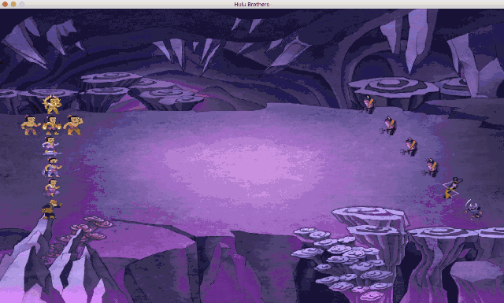
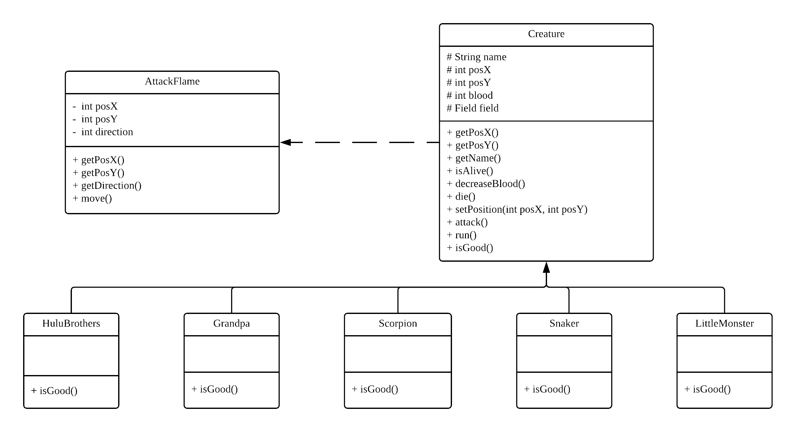
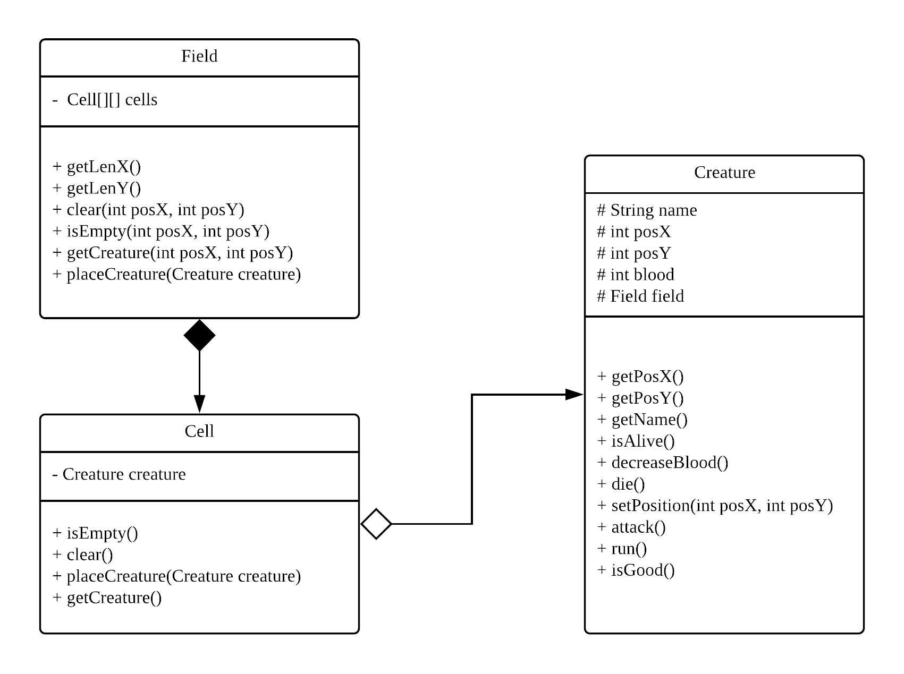
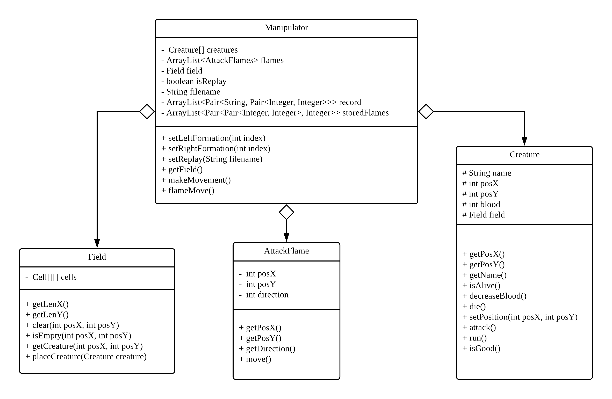

# Java Final Project
杨丽鹤 161180168  <lihe.yang.cs@gmail.com>
## 开发环境
- macOS Mojave 10.14.2
- Eclipse 4.9.0
- Java SE  10.0.1
- JUnit 4

## 结果展示



## 运行说明
- mvn clean test package：运行所有的测试用例
- mvn exec:java -Dexec.mainClass="main.java.application.Main"：运行整个Project
- 项目开始运行后，按空格键开始战斗，每次战斗的过程都会根据开始的时间戳记录在本地的record/new\_record文件夹下；在游戏开始前或游戏结束后，可以按L选择某一次的战斗记录进行回放；在record/old\_record文件夹下已经存储了一些战斗记录，可以直接回看

## 项目结构
- /images：GUI用到的图片素材，比如背景、各种生物、火焰等
- /resources：README文件用到的图片以及视频
- /record/old\_record：一些已有的战斗记录，可以将比较精彩的记录放在这个目录中
- /record/new\_record：每一次战斗新生成的记录
- /src/main/java：项目源代码

## 设计思路
### 对战者
- 对战者包括葫芦娃、老爷爷、蝎子精、蛇精、小喽啰以及火焰，虽然火焰不具有生命，但是和其他的对战者具有一些共同的属性，所以也将其看为对战者
- 除了火焰，其他所有的对战者都继承自基类Creature，其中的属性以及方法如下：



### 战斗空间
- 所有的对战者都存在于一个战斗空间中，此空间用Field类来实现
- 战斗空间有多个位置，每个位置同时只能站一个对战者，将每一个位置用Cell类来实现，表示空间中的一小块，因此每个对战者都是存在于Cell中的；Cell类中有一个Creature成员，此Creature若为空，表示当前的Cell中没有生物，若不为空，则存在某一个生物；Cell与Creature是‘has-A’的关系，Creature离开Cell依然有意义，而Field与Cell是‘contains-A’的关系，Cell只在Field下才有意义，具体结构如下:



### 上帝之手
- 战斗者、战斗空间都可以被上帝操纵，上帝用Manipulator类实现
- 上帝可以让生物体以某种队形站位
- 上帝可以让生物体移动
- 上帝可以让某个生物体被火焰击中后死亡（或减少血量）
- 上帝可以回看之前的战斗记录




## 实现细节
### 继承
- 葫芦娃、老爷爷、蝎子精、蛇精、小喽啰都继承自生物体类

### 封装
- 一些数据，如坐标、血量，无法直接获取，必须调用相应的接口（get方法）

### 多态
- 在Manipulator类、Cell类中，其中包含的都是Creature类，而不是具体的某一种生物类，但这些Creature对象会引用某一种具体的生物对象，并执行其方法，实现了多态

### 聚合
- 上帝Manipulator类中有Creature类和Field类，Cell类中有Creature类，这些都是聚合关系

### 组合
- Field类中包含Cell类，Cell离开了整个的Field也就没有了意义，属于组合关系

### 异常处理
- 在测试程序中，自定义了多个生物体站在相同位置的异常，如果监测到多个生物体的位置相同，则会抛出该异常，如下
```
class SamePlaceException extends Exception {
	private int posX;  
	private int posY;  
}
```

### 集合类型
- 为了保存生物体的运动轨迹以及火焰的位置，通过ArrayList和Pair构造了一个存储三元组的列表
```
// store trace of creatures
ArrayList<Pair<String, Pair<Integer, Integer>>> record = new ArrayList<Pair<String, Pair<Integer, Integer>>>();
// store positions of flames
ArrayList<Pair<Pair<Integer, Integer>, Integer>> storedFlames = new ArrayList<>();
```

### 泛型
- 如上所示，集合框架本身就是泛型的一种应用

### 注解
- 由于用到了继承机制，所以需要@Override注解，编译器可以帮助检查是否是覆盖方法
- 在利用JUnit测试时，也需要为测试方法增加@Test注解

### 输入输出
- 由于需要保存战斗记录以及回放战斗记录，所以需要涉及到文件的输入输出
```
// Output
PrintWriter printWriter = new PrintWriter(new FileWriter(filename, true));
printWriter.println(this.getName() + " " + this.getPosX() + " " + this.getPosY());
printWriter.close();
// Input
in = new Scanner(new FileInputStream(filename));
while (in.hasNext()) {
	String name = in.next();
	int posX = in.nextInt();
	int posY = in.nextInt();
}
in.close();
```

### 多线程同步
- 为了避免多个生物站到同一个位置上，在访问战斗空间时，最多只能有一个生物体访问，若某一个Cell为空，则可以将自己移到该Cell
```
synchronized (Field.class) {
	if (!field.isEmpty(regionX, regionY)) {
		continue;
	}
	field.removeCreature(this);
	posX = regionX;
	posY = regionY;
	savePosition();
	field.placeCreature(this);
	break;
}
```

### 单元测试
- 用JUnit对程序进行测试，主要测试的是线程同步，遍历所有生物，若监测到多个生物体位置相同，则抛出自定义的SamePlaceException
```
for (Creature creature : creatures) {
	for (Creature creature2 : creatures) {
		if (creature != creature2 && creature.getPosX() == creature2.getPosX() && 
			creature.getPosY() == creature2.getPosY()) {
			System.out.print(creature.getName() + " " + creature.getPosX() + " " + creature.getPosY());
			System.out.print(creature2.getName() + " " + creature2.getPosX() + " " + creature2.getPosY());
			throw new SamePlaceException(creature.getPosX(), creature.getPosY());
		}
	}
}
```

## 写在最后
平时上课听的内容总感觉有点抽象，也许是因为第一次上这种不讲语法的语言课程，还不太习惯。但这也让这种大作业变的更有意义，可以自学一些语法，然后将上课讲到的一些设计思想运用到项目中。比如一开始看多线程的内容时，以为自己理解了，但之后在代码中涉及到线程之间协同作用时，总是会出现问题，不过一步步地摸索修改，最终理解的更加透彻了。

无论如何，写完了之后，发现葫芦娃大实验是一种很美好的存在，不仅强化了Java相关的知识，而且看到最终的GUI效果后，也感觉很有成就感，付出都是值得的。

